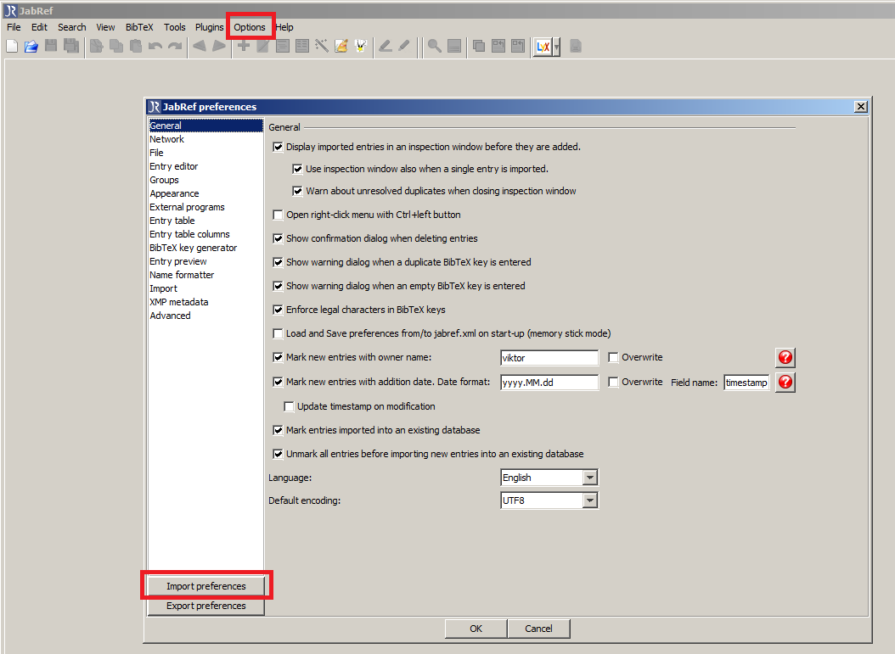

### About

Exporting BibTex database to the HTML filw with help of JabRef.

### How to use

* Download jar file of [JabRef](http://jabref.sourceforge.net/download.php)
* Configure JabRef for particular exporting template (you can refer to this list as well [JabRef - Custom export filters](http://jabref.sourceforge.net/help/CustomExports.php))
	* 
	* 
	* 
* Copy your collection of the bibtex into 'bibliography.bib'
* Configure and run 'html-vlba.bat'
* **NOTE** preferences for the JabRef can be found in [jabref-preferences](jabref-preferences) file
    - Preferences can be imported as shown on the picture 

### Important Notes

* In case you need an automation, you can connect html generation process with ORCID service. Use example from pyorcid library [orcid_bibtex_to_html.py](https://github.com/vdmitriyev/pyorcid/tree/master/examples) that will help you to access the ORCID and prepeare everything.
* In case of CMS TYPO3, in order to have proper HTML render, the HTML should be saved into "HTML" type page
* In case the custom sorting required, use this configuration [Export the Bibliography as You Like Using Jabref](http://liu-cv.blogspot.de/2011/03/export-bibliography-as-you-like-using.html) for JabRef.

### Dependencies

* [Java](https://www.java.com/en/download/)
* [JabRef](http://jabref.sourceforge.net/download.php)

### Materials

* [JabRef - Command line options](http://jabref.sourceforge.net/help/CommandLine.php)
* [JabRef - Custom export filters](http://jabref.sourceforge.net/help/CustomExports.php)

### Author

* Viktor Dmitriyev
